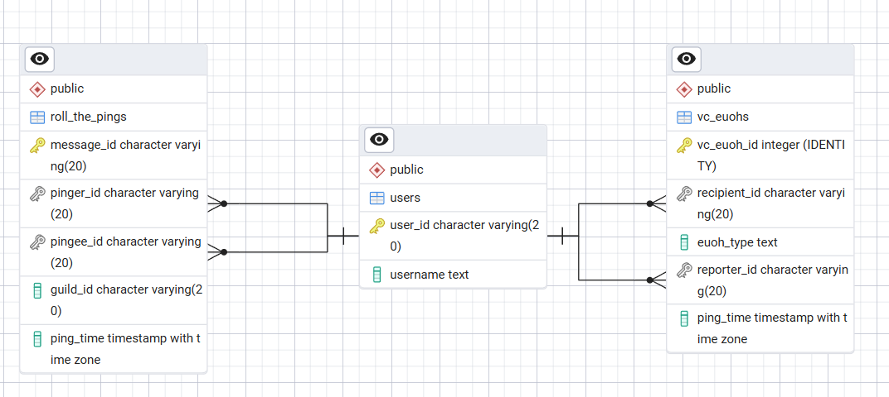

# ERD for Petrichor Database


# Database Schema

## `users` Table
Used to hold data relating to the users of the bot.

```sql
CREATE TABLE IF NOT EXISTS users(
    user_id VARCHAR(20) PRIMARY KEY,
    username TEXT
);
```


## `roll_the_pings` Table
Used to hold the results of all instances of `/rtp` used.

```sql
CREATE TABLE IF NOT EXISTS roll_the_pings(
    message_id VARCHAR(20) PRIMARY KEY,
    pinger_id VARCHAR(20) REFERENCES users(user_id),
    pingee_id VARCHAR(20) REFERENCES users(user_id),
    guild_id VARCHAR(20),
    ping_time TIMESTAMPTZ
);
```


## `euoh` Tables
Used to hold the results of all instances of `/euoh <type>` used.

```sql
CREATE TABLE IF NOT EXISTS vc_euohs(
    vc_euoh_id INTEGER GENERATED ALWAYS AS IDENTITY PRIMARY KEY,
    recipient_id VARCHAR(20) REFERENCES users(user_id),
    euoh_type TEXT,
    reporter_id VARCHAR(20) REFERENCES users(user_id),
    guild_id VARCHAR(20),
    ping_time TIMESTAMPTZ
);
```
